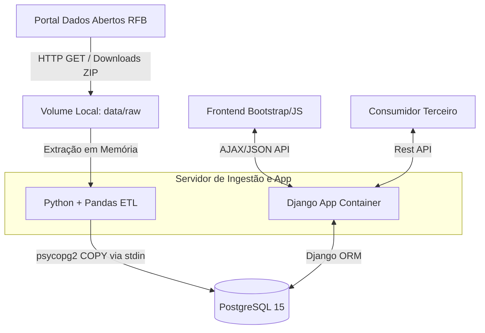

# Arquitetura Física e Componentes

Neste documento explicamos como as peças chave do software se intercomunicam para processar as grandes bases de dados abertos.

## Diagrama da Arquitetura C4 (Nível de Contêineres)

## Por que não usaram Elasticsearch?

No início do projeto, havia código esboçado para manter uma sincronização dupla: base relacional no Postgres e índice textual no Elasticsearch-DSL para melhorar a busca de "Razão Social" / "Nome Fantasia". 

Isso foi refatorado e **removido** pelos seguintes motivos arquiteturais:
1. **Redundância:** O ganho na latência de busca (ms) perante os índices do Postgres não cobria a complexidade extra de ter que popular 200 milhões de registros em dois bancos distintos.
2. **Custo Operacional e Memória RAM:** Um contêiner Elastic consome na ordem de Gigabytes sem ajustes drásticos. Retirar esse serviço economizou quase `2.5 GB` de memória RAM permitindo que o sistema rodasse polido em provedores menores (Cloud tipo VPS simples).
3. **Efetividade dos Índices no Postgres:** A criação de chaves B-Tree adequadas nas tabelas de `Estabelecimento` e `Empresas` e buscas de cruzamentos (subqueries `__in`) pelo Django entregaram pesquisas abaixo de 100ms consistentemente, tornando o Search Engine impraticável sob a ótica de custo/benefício.

## O stack final:
- **Linguagem Principal**: Python 3.11+.
- **Database**: PostgreSQL 15, rodando orquestrado localmente.
- **Framework Web**: Django 4.2. Usado tanto para expor a rota de comandos de terminal (management commands customizados) quanto o servidor WSGI (Gunicorn).
- **Frontend Core**: Bootstrap 5 Vanilla provendo responsividade cross-device e views de tabelas ricas, complementados pelo Chart.js na evolução histórica.
- **Data Engineering**: Processamento dos blocos fragmentados com a interface em matriz de Dataframes (via biblioteca `pandas`).
