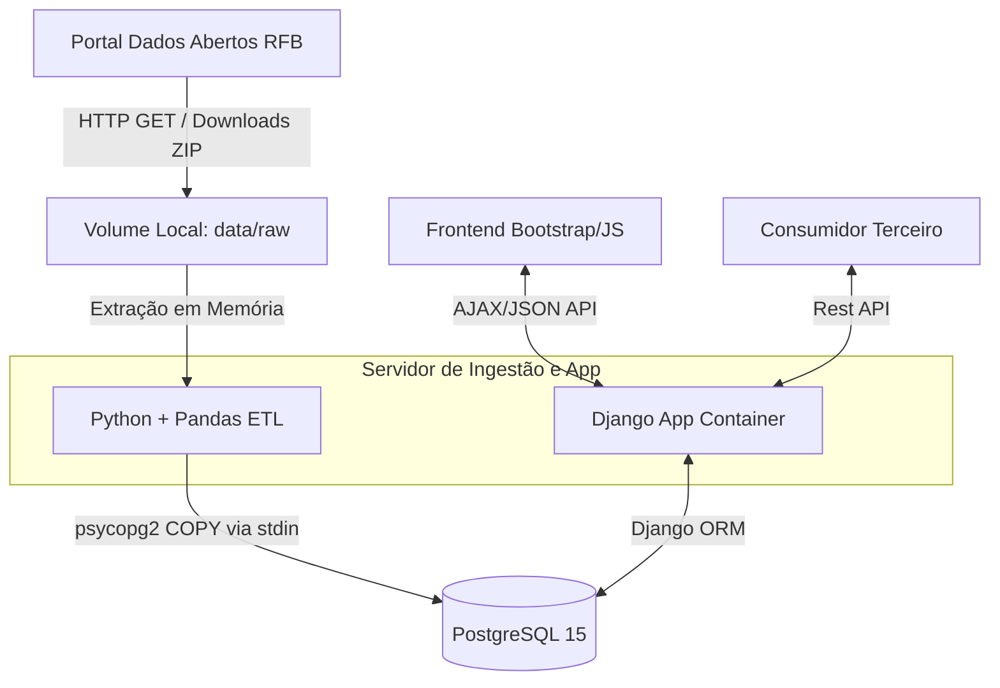

# Arquitetura Física e Componentes

Neste documento explicamos como as peças chave do software se intercomunicam para processar as grandes bases de dados abertos.

## Diagrama da Arquitetura C4 (Nível de Contêineres)

```mermaid
graph TD;
    RFB[Portal Dados Abertos RFB] -->|HTTP GET / Downloads ZIP| RAW[Volume Local: data/raw]
    
    subgraph Servidor de Ingestão e App
        APP[Django App Container]
        ETL_CMD[Python + Pandas ETL]
    end
    
    RAW -->|Extração em Memória| ETL_CMD
    ETL_CMD -->|psycopg2 COPY via stdin| DB[(PostgreSQL 15)]
    
    APP <-->|Django ORM| DB
    FRONT[Frontend Bootstrap/JS] <-->|AJAX/JSON API| APP
    API_CONSUMER[Consumidor Terceiro] <-->|Rest API| APP
```

## O Motor de Busca (Elasticsearch)

Para garantir uma barreira de busca incrivelmente rápida e tolerante a erros de grafia (fuzzy matching) sobre uma base de 60 milhões de registros, o Portal adota um padrão de sincronia híbrida:

1. **PostgreSQL** atua como banco primário. Retém as cargas brutas de CSV, as chaves de particionamento e todas as amarrações do negócio (Socios, Endereços, Matriz/Filial).
2. **Elasticsearch (8.x)** atua como Engine de Pesquisa focada. Recebe blocos mastigados via workers paralelos contendo as chaves vitais de Razão Social e Fantasia.

> [!TIP]
> Essa separação permite que o buscador faça queries `match` ricas textualmente num índice raso `(CNPJ, Nomes)` retornando em `15ms`. O Backend recebe essa lista de CNPJs básicos e então extrai o resto do painel estruturado completo do Postgre de uma vez através de chaves exatas `__in`.

## O stack final:
- **Linguagem Principal**: Python 3.11+.
- **Database**: PostgreSQL 15, rodando orquestrado localmente.
- **Search Engine**: Elasticsearch 8.x, acessado via `elasticsearch-dsl`.
- **Framework Web**: Django 4.2. (FBVs, ORM e WSGI).
- **Código Front**: Bootstrap 5 Vanilla + interatividade do Swagger para rotas de API.
- **Qualidade & Automação**: Formatters em Rust (Ruff), Unit Tests no pytest, automação por Makefile.
- **Data Engineering**: Processamento distribuído com `ProcessPoolExecutor`, otimizando memória via chunks.
