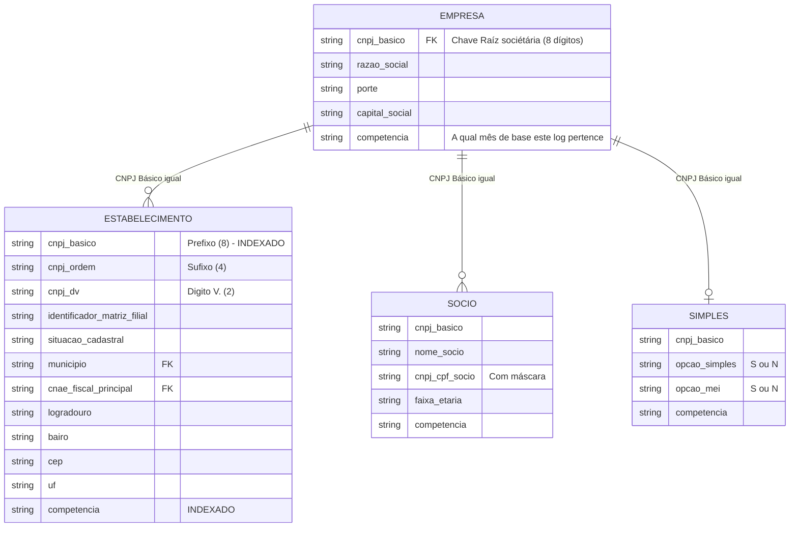

# Diagrama e Modelagem do Banco de Dados

Toda extração flui pelas tabelas parametrizadas do Django, mantendo versionamento em massa focado no mês em que a informação cadastral foi disponibilizada (A chamada `Competência`).

## Entidades Fixas (Domínio)
Tabelas menores sem acompanhamento de histórico / variação mensal. Toda vez que uma Carga flui no pipeline, essas tabelas são esvaziadas (truncate) e recarregadas.
* `cnpj_cnae`: Catalógo principal dos números de atividades de comércio. (~1.300 registros)
* `cnpj_municipio`: Dicionário geográfico de munícipios brasileiros por código IBGE/TSE.
* `cnpj_pais`, `cnpj_natureza`, `cnpj_qualificacao`, `cnpj_motivo`.

## Tabelas Principais (Entidades)
Agrupam dezenas de milhões de itens, contínuamente incrementadas e retendo dados passados graças ao controle primário pela coluna `competencia`.

> [!NOTE]
> Observe no mapa relacional acima que **não existem `ForeignKeys`** físicas na base em colunas chaves (apenas indexações B-tree). Evitamos FKs reais para anular qualquer impacto de travamento (Locks) de cascata ao rodar operações de limpeza de `CASCADE constraints` durante os ETLs. A junção dessas chaves nas visualizações de tela é realizada abstraindo o número do `CNPJ Básico` do registro em runtime no ORM.
